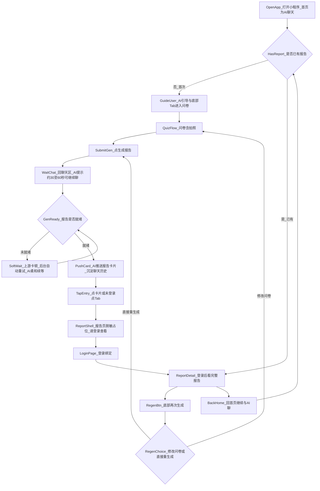

# UX v0 调研输入（v1.0 定稿 · Owner 已确认）

| 字段 | 值 |
|------|-----|
| **版本** | **v1.0**（定稿，可作 UX 会话唯一输入） |
| **撰写日期** | 2026-05-03 |
| **Owner 确认** | 2026-05-03（口头/聊天确认，以本文件版本字段为准） |
| **来源** | Owner ↔ PMO（Cursor）对话纪要 |
| **上游依据** | [docs/team-roles.md](../team-roles.md)、[docs/宪章-AI护肤助理.md](../宪章-AI护肤助理.md)、[docs/implementation-v1.md](../implementation-v1.md) |

---

## 1. 本期范围（写死）

**只覆盖一条主链路**，不扩到收藏 / 我的产品 / 订单等周边：

> **匿名进入** → **首页与 AI 聊天** → **AI 引导 + 底部 Tab 进入问卷（含拍照）** → **生成报告** → **回到聊天区等待** → **AI 推送报告卡片（永久在聊天历史）** → **点击卡片 / Tab 进入报告相关页并登录** → **登录后看报告** → **报告页可再次生成** → **回首页继续聊**

---

## 2. 主流程图（体验叙事）

> **图注（简略）**：`HasReport_是_已有` 在 **未登录** 时仍应先落到 **报告页壳**（见 #12）再登录，图中为与 `reportDetail` 的叙事合并；UX 定稿时可拆成「已登录 / 未登录」两子路径。

---

## 3. Owner 已定稿的 13 条（编号唯一）

### 3.1 入口与动线

| # | 要点 |
|---|------|
| **1** | **首次**：AI 在聊天里引导 + **底部「护肤报告」Tab** 均可进入问卷（双入口）。 |
| **2** | **已有过报告**（任意时刻、任意入口）：一律进入 **最后一次生成的报告**；要重新跑流程 → 仅用报告页底部 **「再次生成」**，不从问卷入口重复「假装首次」。 |
| **12** | **未登录**用户点底部 Tab：先进入 **报告页壳**（脱敏占位：「请登录查看」等），再引导去 **登录**（与「点聊天里报告卡片」手感一致）。 |
| **13** | **首次进入小程序**：AI 开场基调为 **「先聊、后报告」**——先陪伴护肤烦恼，用户准备好再生成报告（转化不抢跑）。 |

### 3.2 异步生成与等待

| # | 要点 |
|---|------|
| **4** | 用户点「生成报告」后 **回到聊天页**；AI 发一条 **柔和等待** 文案（约 30～60 秒量级），并说明 **可继续聊** 护肤问题或烦恼。 |
| **5** | **上游卡顿 / 超时**：**后台自动重试**；前端 AI **不说「失败」、不中断陪伴**，持续柔和续等（与 #4 同一语气家族）。 |
| **11** | 报告 **生成中**：底部「护肤报告」Tab **置灰不可点**；若用户 **强触**（多次点击/长按等，阈值由 UX 定），AI 在聊天里发：**「报告加速生成中……」**（情感化反馈，替代额外 loading 弹层）。 |

### 3.3 报告卡片与历史

| # | 要点 |
|---|------|
| **6** | 报告就绪后，由 AI 在 **聊天里推送「报告卡片」**；该消息 **永久沉淀在聊天历史**，用户 **可反复点开**（避免「报告丢了」）。 |
| **7** | 等待期间用户 **切走 / 关小程序**：**不主动发** 订阅/服务通知；下次进来 **被动** 在聊天里看到已发出的卡片即可（实现最轻、合规风险最低）。 |

### 3.4 登录与绑定

| # | 要点 |
|---|------|
| **8** | **登录前不得展示任何报告实质内容**（摘要、分数、成分列表等均不可见）；**查看任何报告内容**必须先完成登录 / 绑定（与《宪章》非医疗、能力边界告知可并行由 UX 写进页脚，本稿不代写文案）。 |
| **9** | 用户从报告卡片或报告壳进入 **登录页** 后 **取消 / 返回 / 关闭**：回到 **聊天页**；AI 补一条 **软提醒**（不强迫），例如可随时再点卡片查看——**不**采用留在登录页硬拦方案。 |

### 3.5 问卷与再次生成

| # | 要点 |
|---|------|
| **3** | 报告页底部 **「再次生成」** → 弹窗 **二选一**：**「修改问卷」** / **「直接重新生成」**（后者沿用上轮问卷数据重跑）。 |
| **10** | 问卷 **未完成就退出**（关小程序、切走、回聊天）：下次进入问卷流程时 **先弹窗**：**「接着填」** / **「重新填」**（需本地或服务端草稿支持，实现复杂度由 FE/BE 评估，本稿只定产品行为）。 |

---

## 4. 与 `implementation-v1.md` §5.2 的对照（技术不动、体验可叙事）

[implementation-v1.md §5.2](../implementation-v1.md) 当前字面顺序为：`user/init` → 采集 → `report/task/create` → 轮询 `status` → `done` 后 **跳转报告页** → `report/detail` → **查看完整报告时** `user/bind`。

**本 v0 稿在体验层增加/强调**：

- **等待主场景在「首页聊天区」**（而非整页停在问卷或单独 loading 页）；`done` 之后以 **AI 推送聊天卡片** 为显性触点，再进入报告壳 / 登录 / 详情。
- **登录门闸**：与文档「查看完整报告时绑定」一致，但 Owner 要求 **任何报告内容** 均在登录后可见，故 **报告页壳也必须脱敏**，与原文「先进报告再点查看完整」的细分可能略有 UI 顺序差异——**UX 定稿后**若需统一字面流程，由 PMO 发起对 `implementation-v1.md` 的**小版本修订**，本文件不替代该文档的技术权威。

底层接口与状态枚举（`pending` / `running` / `done` / `failed`、2s 轮询、60s 超时等）仍以 `implementation-v1.md` 为准。

---

## 5. 留给 UX 会话自定的小事（不阻塞 v0 主决策）

以下 **不写死**，由 **交互架构 (UX)** 在首版交互说明里给默认建议 + Owner 过稿即可：

- Tab **文案**（「护肤报告」/「报告」/「我的报告」等）。
- **逐字文案**：首次招呼、等待中、加速生成中、登录引导、再次生成弹窗、问卷续填弹窗、登录取消后的软提醒等（须可对照《宪章》语气，避免医疗承诺与恐吓转化）。
- **报告卡片** 在「未登录 / 已登录」两态下的 **视觉与字段**（未登录仅允许中性引导语，见 #8）。
- 可选：是否在 **「我的」或设置** 内增加二级入口「我的报告」——**非本期必做**。
- Tab **置灰** 与 **强触** 的判定阈值、防抖、无障碍可读性。

---

## 6. 验收（Owner 一眼）

- [x] 上表 **13 条** 与对话纪要 **一一对应**，无遗漏、无擅自新增产品决策。
- [x] 主流程图 §2 与 §3 文字 **无矛盾**。
- [x] §5 所列均为 **文案/视觉/阈值**，不含主流程分支裁决。

---

**v1.0 定稿：Owner 已确认；下一步请开【交互架构 UX】会话，仅依据本文件 +《宪章》输出《交互说明》（状态表 + 跳转 + 边界），再由 PMO 拆工单给 FE。**
